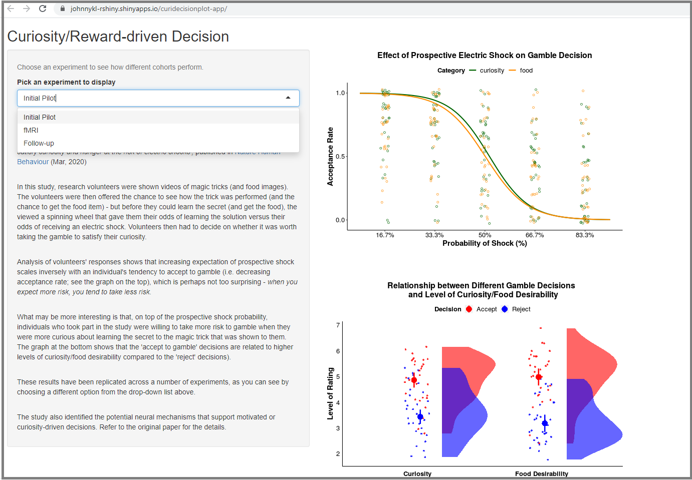

# rshiny_curiositystudyplots
A <a href="https://johnnykl-rshiny.shinyapps.io/curidecisionplot-app/">mini project for  data visualisation</a>, using RShiny, to facilitate understanding of the results from <a href="https://www.nature.com/articles/s41562-020-0848-3">a previous research study</a> that looks at curiosity-driven/motivated risky decisions.

  

For the main data repository of this study, visit the corresponding OSF project: https://osf.io/mafe3/; or for better explanation of the codes for these plots, check the Markdown files in this <a href="https://github.com/jonkingseestheworld/curiosity_fmri_study"> repo </a>. 
